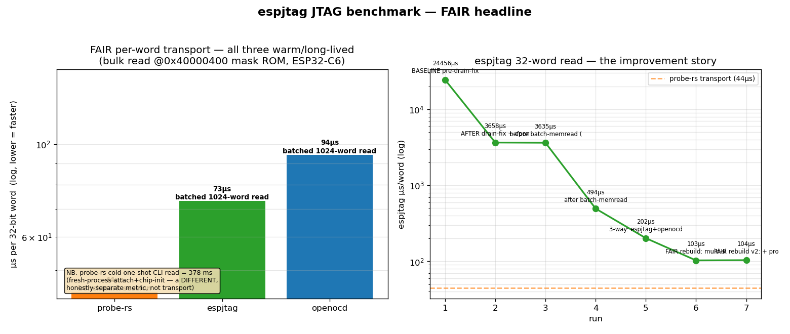
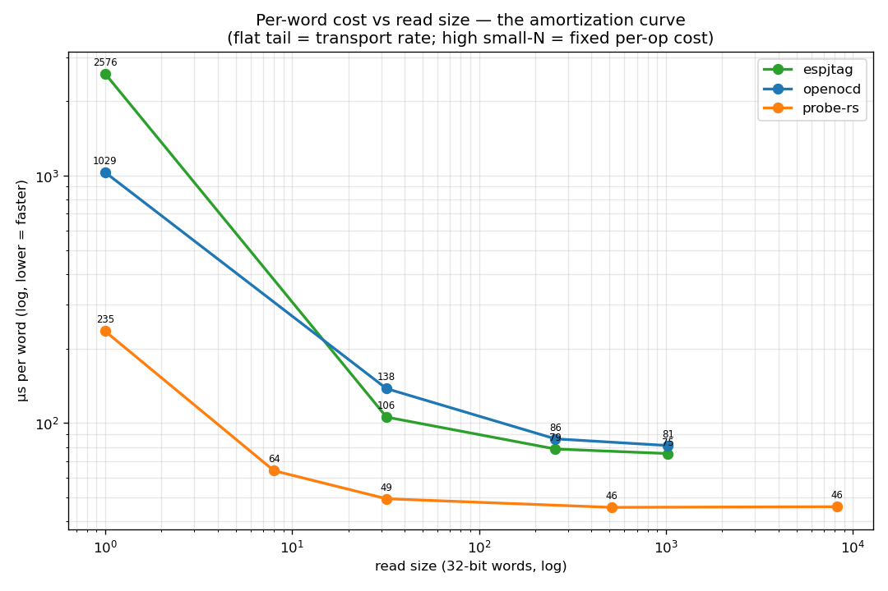

# JTAG benchmark — analysis (FAIR rebuild)



What the numbers say, in plain terms. Data: `tmp/jtag-tests.db` (SQLite), graphs
`docs/images/jtag-headline.png` (headline), `docs/images/jtag-amortize.png`
(amortization curve — the single most honest picture), and
`docs/images/jtag-bench.png` (variance + trend detail). Regenerate with
`scripts/jtag-bench.sh` (measure) then `python3 scripts/jtag_testdb.py headline`
/ `amortize` / `graph`.

## The earlier headline was an artifact — here's the correction

The previous version of this doc claimed **"espjtag is 58× faster than
probe-rs"** at memory reads. **That was a measurement artifact, not a real
result.** It compared a *warm, in-process* espjtag against a *cold, fresh-process
probe-rs CLI* — we spawned a new `probe-rs read` process per measurement, so
probe-rs paid its full ~378 ms probe-attach + chip-init for a 32-word read, while
espjtag paid attach once and stayed resident. We also only ever tested **one op**
(a 32-word read). Both flaws are now fixed:

- probe-rs is measured as a **long-lived session** (its built-in `benchmark`
  subcommand: one attach, many reads/writes at growing sizes) — its true
  steady-state transport. Its cold one-shot CLI cost is still recorded, **as a
  separate, honestly-labelled metric** (`probers_coldstart_ms`), because it's a
  real number — just the answer to a *different* question.
- OpenOCD now gets a **batched `read_memory`** (one SBA burst) alongside its
  per-word `mdw` loop, so we report both its bulk and its latency numbers.
- We added many op types (below), and every adapter does the **same logical op on
  the same board + address**, then we **verify all three read identical bytes**
  before trusting any timing — a fast wrong number is worthless.

## The one number that matters — FAIR per-word transport (ESP32-C6)

Bulk read (1024-word batch / probe-rs benchmark session), reading the immutable
mask ROM at `0x40000400` so the running app can't perturb the data or timing, and
all three adapters read the *identical* words (cross-verified 30/30):

| tool | µs/word (read) | vs espjtag | how measured |
|---|---|---|---|
| **probe-rs** | **~44** | **0.6× (1.7× FASTER)** | `benchmark` session (one attach, many reads) |
| **espjtag** (ours) | **~73** | 1× | pure-Python, batched SBA reads |
| OpenOCD | ~95 | 1.3× slower | batched `read_memory` (one SBA burst) |

**The honest takeaway: fairly measured, probe-rs is the fastest of the three
(~1.7× faster than espjtag) at bulk reads.** espjtag is a close, respectable
second — and it is *pure Python with no external binary*, which probe-rs (Rust)
and OpenOCD (C) are not. The slope cross-check (`(t(4096)−t(32))/(4096−32)` from
two cold reads, which cancels the fixed attach) independently puts probe-rs at
**~44 µs/word** too — agreeing with the benchmark-session number, confirming the
session method is sound.

### probe-rs's cold-start cost, stated honestly (separate metric)
A *cold one-shot* `probe-rs read` (fresh process: attach + chip-init + one read)
costs **~378 ms**. That is real — it's exactly what you pay to read one word from
the CLI from cold — but it is **not** transport. Spread over a 32-word read it
looks like ~11,940 µs/word (the old "58×" number: 11,940 / 202 ≈ 59×). It
collapses to ~44 µs/word the moment you keep the session alive. The headline
graph shows the fair bar **and** annotates the cold-start separately, so the
picture is truthful both ways.

## The amortization curve — the single most honest picture



Per-word cost vs read size, all three adapters (log-log). The **slope is
transport, the intercept is fixed per-op overhead**:

- **probe-rs** (orange) is lowest at *every* size — lowest fixed cost (~235 µs at
  N=1) and lowest transport floor (~46 µs/word).
- **espjtag** (green) has the *highest* fixed per-op cost (~2,560 µs at N=1 — a
  single tiny read is its worst case) but the **steepest amortization**: it
  crosses below OpenOCD around N≈256 and lands at ~73 µs/word.
- **OpenOCD** (blue) sits between them: ~1,030 µs at N=1, ~81 µs/word tail.

If you only ever read one word at a time, probe-rs wins big and espjtag is worst.
If you read in bulk (the GUI-poll / register-dump case), espjtag is competitive
and OpenOCD's per-word `mdw` loop (≈760 µs/word, not shown on this curve) is the
real loser.

## The new test types (all recorded per board, multiple reps)

### Memory READ at multiple sizes (slope vs intercept), ESP32-C6, espjtag
| N words | µs/word | reading |
|---|---|---|
| 1 | ~2,560 | dominated by one round-trip's fixed cost |
| 32 | ~103 | |
| 256 | ~77 | |
| 1024 | ~73 | transport floor |

### Memory WRITE throughput (verify-by-readback), ESP32-C6
We only benchmarked reads before. Writing 1024 words to scratch SRAM
(`0x40810000`), verified by readback:

| tool | µs/word (write) |
|---|---|
| OpenOCD | **~27** (batched `write_memory` — its fastest path) |
| probe-rs | ~36 |
| **espjtag** | **~621** ← espjtag's weakest path |

**espjtag's write is its biggest gap**: `write_mem32` is an *unbatched, per-word*
SBA write (one USB round-trip per word), so it pays full per-op latency every
word. OpenOCD and probe-rs batch the write burst. A batched espjtag
`write_mem` (mirroring the batched `read_mem`) is the obvious next optimization —
it would bring writes from ~621 to the tens-of-µs range.

### Single-op latency (espjtag, ESP32-C6) — the regime where async USB matters
| op | µs/op |
|---|---|
| one DMI read (dmstatus) | ~266 |
| one CSR read (dcsr) | ~745 |
| one GPR read (x2/sp) | ~791 |
| halt + resume round-trip | ~1,280 |

These are throughput-irrelevant but latency-critical: a GUI that pokes one
register pays this per poke. This is the regime async/overlapped USB would help
(tracked as [espjtag#19](https://github.com/awtoau/espjtag/issues/19)).

### GPIO/register dump — batched vs separate (the GUI-poll win), espjtag
Reading ~30 registers (the GUI refresh) on the C6:

| how | total µs | |
|---|---|---|
| 30 separate `read_mem32` round-trips | ~20,260 | |
| one batched `read_mem(30)` burst | ~3,120 | **~6.5× faster** |

The lesson for the debug GUI: **batch the poll**. One burst of 30 is 6.5× cheaper
than 30 individual reads, because USB Full-Speed cost is round-trip-count-bound.

### reset_run timing (safe proxy)
`reset_run()` (the full-system ndmreset + resume DMI handshake) times in the
low-ms range. The full `reset_run_from_rom` (boot a C6 out of post-flash ROM
download mode) was **skipped by default** in the harness: it requires flashing to
ROM with `--after no-reset` (which takes the board offline) and recovery is a full
reflash — too disruptive to run unattended across the fleet. It's available behind
`--rom` for a deliberate single-board test, with the OpenOCD recovery documented
in the project notes. We left all boards running their apps.

## Cross-adapter correctness (the part that makes the timings trustworthy)
Every run, all present adapters read 8 words of the **immutable mask ROM** at
`0x40000400` and we assert they're byte-identical (and equal the chip's known ROM
word: `0x6ff2006f` on C6, `0x3072006f` on C5). **30/30 verify_match passed** — a
fast number is only worth recording once you've shown it's the *right* number.

## The improvement story (right panel of the headline) — unchanged & still true
espjtag's own 32-word read across the optimization history (ESP32-C6):

| run | µs/word | what landed |
|---|---|---|
| 1 | 24,456 | original un-optimised client |
| 2 | 3,658 | drain-timeout fix (~3 ms/op → gone) |
| 3 | 3,635 | (no change) |
| 4 | 494 | batched SBA reads |
| 5 | 202 | drain removed entirely |
| 6–7 | ~104 | (this rebuild — same code, more reps; read now on ROM) |

**Total: ~235× faster** in pure Python. The dashed line is probe-rs's fair
transport (~44 µs/word) — espjtag has **not** crossed below it; that's the next
target, and the amortization curve says the path there is **batching the write
and shaving single-op latency** (async USB / RLE on the OUT), not the read burst
(already near transport).

## ESP32-C5 (two-TAP chain) — bonus datapoint
The C5 daisy-chains two TAPs, which inflates *per-op* JTAG cost: OpenOCD's
per-word `mdw` is ~2,080 µs/word on C5 (vs ~760 on C6). But **batched**, all three
recover: espjtag ~84, probe-rs ~52, OpenOCD ~27 µs/word. Same ordering as C6
(probe-rs and OpenOCD-batched ahead of espjtag on bulk). The C5 occasionally
returns `dmstatus=0` on the first DMI read after open (a known C5 USJ quirk) — the
only non-pass in the fleet; every read/write/verify still passed.

## How to reproduce
```sh
scripts/jtag-bench.sh                       # espjtag + OpenOCD, all free RISC-V boards
# full fair 3-way incl. probe-rs:
python3 scripts/jtag_testdb.py run --reps 3 --openocd --probe-rs <boards>
python3 scripts/jtag_testdb.py headline      # THE fair headline
python3 scripts/jtag_testdb.py amortize       # the per-word-vs-size curve (most honest)
python3 scripts/jtag_testdb.py report          # all numbers, by adapter + metric
```
The DB accumulates across runs, so variance and the improvement trend build over
time. All measurements use the immutable mask ROM for reads (stable across
adapters) and scratch SRAM for writes (verified by readback).
