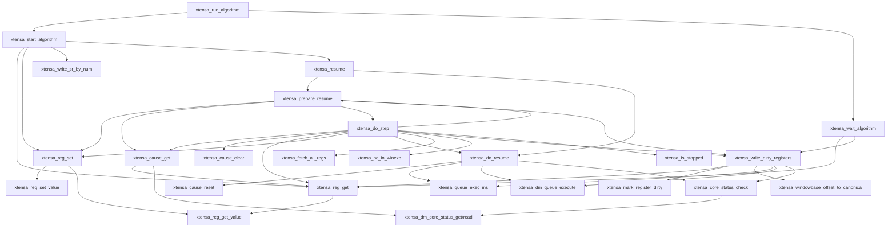

# Port map — Xtensa resume/register-cache (the #29 "verbatim, full" port)

The dependency closure of `xtensa_resume` / `xtensa_run_algorithm`, mapped from
openocd-esp32 `src/target/xtensa/xtensa.c` **@ `f10eceff22fb8dcd3db69bf3ebc5c70602454af6`**
before porting any of it (per `FAITHFUL-REIMPLEMENTATION.md`: read all → map deps →
port leaves first).

Arrows = "calls / depends on". **Port in reverse-topological order: leaves
(bottom, no outgoing arrows) first, each tested before anything above it.**

## Port order (reverse-topological — leaves first)

1. **`reg_get` / `reg_set`** — register *cache* accessors (read/write
   `reg_list[i].value`, set `.dirty/.valid`). True leaves. **No JTAG.** Testable
   against a cache model with no hardware.
2. **`reg_get_value` / `reg_set_value`** — the per-`struct reg` value get/set the
   above call. (Trivial; fold into #1.)
3. **`cause_get`** — DEBUGCAUSE accessor (reads the cached DEBUGCAUSE reg / core
   status). Depends only on #1 + the DM status read we already have.
4. **`core_status_check`** — already exists in espjtag (verify it matches).
5. **`mark_register_dirty`, `windowbase_offset_to_canonical`** — cache-only
   helpers `write_dirty` needs. Leaves (no JTAG).
6. **`write_dirty_registers`** — flush dirty cache → core (the big one; uses
   `queue_exec_ins`/`dm_queue_execute` we have, + #1/#5).
7. **`do_step`** — single-step (needs #1,#3, `fetch_all_regs`, `pc_in_winexc`,
   and recursively `prepare_resume`/`do_resume` — mind the cycle).
8. **`prepare_resume`** — set PC, DEBUGCAUSE single-step-over-BREAK (#7), write
   hw-breakpoints, `write_dirty` (#6). **This is the step #29 dropped.**
9. **`do_resume`** — `cause_reset` (LX no-op) + RFDO + status check.
10. **`resume` = prepare_resume + do_resume.**
11. **`start_algorithm` / `wait_algorithm`** rebuilt on `resume` + the cache.

Note the cycle `do_step ⇄ prepare_resume ⇄ do_resume`: port the three together as
one unit (they're mutually recursive in the source — don't try to split them).

## Scope decision (locked)

**Full descriptor model.** `write_dirty_registers` (#6) is ported with OpenOCD's
whole register model brought in verbatim: the `xtensa_regs[]` descriptor table,
the `XT_REG_SPECIAL/USER/FR/TIE` type tags, the optregs split, windowbase
canonicalization, and the CPENABLE-delay / MS-after-AR ordering quirks. No subset,
no "only the path the algorithm exercises" shortcut. This adds extra leaves —
`xtensa_regs[]` table, `mark_register_dirty`, `windowbase_offset_to_canonical` —
all ported and tested before #6. Maximally faithful; diffs 1:1 against OpenOCD.

This means a new module holding the faithful cache model (`xtensa_regs[]`,
`struct reg`-equivalent, get/set/dirty), kept separate from the existing
hand-rolled `xtensa.py` NAR layer so the port stays diffable against the source.
